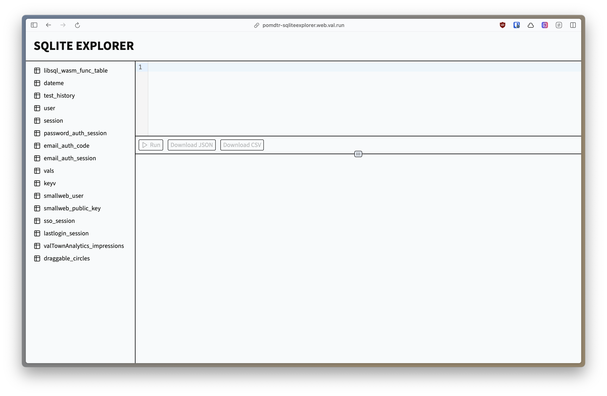

# Sqlite Explorer



## Setup

Rename `.env.template` to `.env` and update the values.

## Commands

- `deno task dev`: start development server
- `deno task publish`: publish to jsr (ignore the warnings)

## Installation

### Val.town

```ts
import { createApp } from "jsr:@pomdtr/val-town-sqlite-explorer@0.0.3";

// the `valtown` env variable will be used as a token
const app = createApp();

export default app.fetch;
```

### Deno Deploy / Smallweb

```ts
import { createApp } from "jsr:@pomdtr/val-town-sqlite-explorer@0.0.3";

const app = createApp({
    // the token is required for the app to work
    token: Deno.env.get("VALTOWN_TOKEN"),
});

export default app;
```
